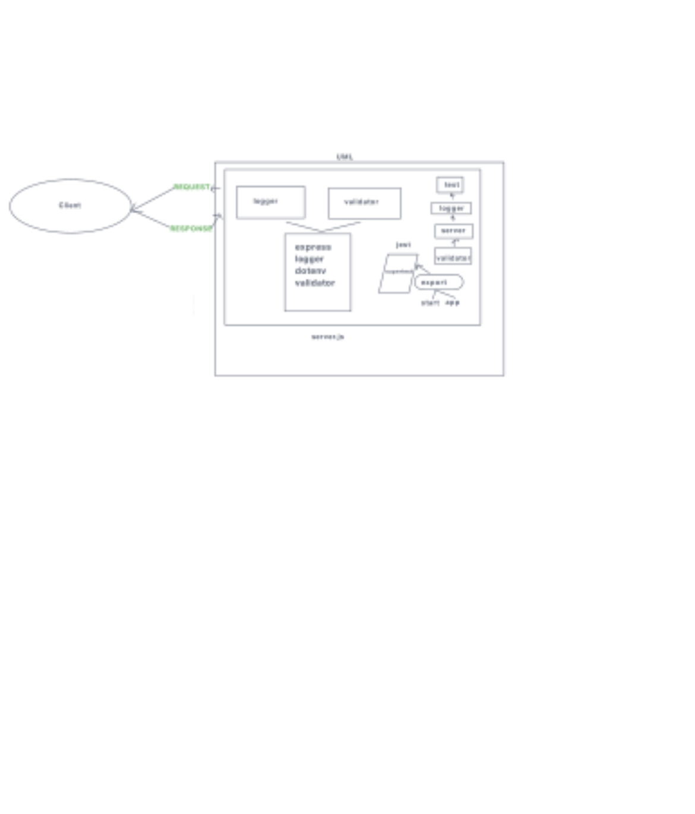

# Project: Basic-Express-Server

## Author: Hayden Cooper

## Problem Domain

- Deploy a simple Node.js server to EC2, using Elastic Beanstalk

        - Choose a server you’ve built previously

            - Option 1: A simple API or Web Server
            - Option 2: A socket.io event Hub
            - The server should not require a database

- Check in your server to GitHub
  - Task 1:

    - Create a new environment, using Elastic Beanstalk from the AWS Control Panel (GUI)
        Manually deploy your application to this environment by uploading a .zip file
  - Task 2:

- Using the same server, create a new environment using Elastic Beanstalk from your terminal

- Manually deploy your application to this environment by using eb deploy

## Links and Resources

- [GitHub Actions ci/cd](http://basic-express-server-dev.us-east-2.elasticbeanstalk.com/)
- [back-end dev server url](http://labawscloudservers-env.eba-aiqvft42.us-east-2.elasticbeanstalk.com/)

## Collaborators

Ryan Gallaway/ seat401d53/ chatgpt

## Setup ///

## `.env` requirements (where applicable)

node version "v19.6.1"

## How to initialize/run your application (where applicable)

To create a new environment using Elastic Beanstalk from the AWS Control Panel (GUI), follow these steps:

1. Log in to your AWS Management Console.

2. Navigate to the Elastic Beanstalk service by searching for "Elastic Beanstalk" in the search bar and selecting it from the results.

3. In the Elastic Beanstalk dashboard, click on "Create a new environment" to start the environment creation process.

4. Choose the application you want to create an environment for. If you haven't created an application yet, you can click on "Create new application" and provide the necessary details.

5. Select the platform for your environment. Elastic Beanstalk supports various platforms such as Node.js, Java, Python, PHP, and more. Choose the one that matches your application's requirements.

6. Choose the environment tier based on your needs. You can select either Web Server Environment or Worker Environment, depending on the nature of your application.

7. Configure the environment settings. Provide a unique environment name, and optionally, a description. Specify the domain name, platform version, and other settings as required.

8. Configure the capacity settings. Choose the instance type, instance count, and scaling options based on your application's resource requirements and expected traffic.

9. Customize the environment. You can customize the environment by providing additional configurations, such as security settings, environment variables, and database configurations.

10. Review the configuration details. Double-check the configuration settings you have provided to ensure everything is accurate.

11. Click on "Create environment" to initiate the creation process. Elastic Beanstalk will start creating the environment based on your configuration.

12. Wait for the environment to be created. This process may take a few minutes. You can monitor the progress on the Elastic Beanstalk dashboard.

13. Once the environment is successfully created, you can access it by clicking on the environment's name in the Elastic Beanstalk dashboard. From there, you can manage and deploy your application.

By following these steps, you can create a new environment using Elastic Beanstalk through the AWS Control Panel (GUI) to host and manage your application effortlessly.

## Routes

- Npm Test and install npm Jest if no test runs

## Tests

to run tests, after running `npm i`, run the command `npm test`

## UML

//////////////////////////////////////////////////////
